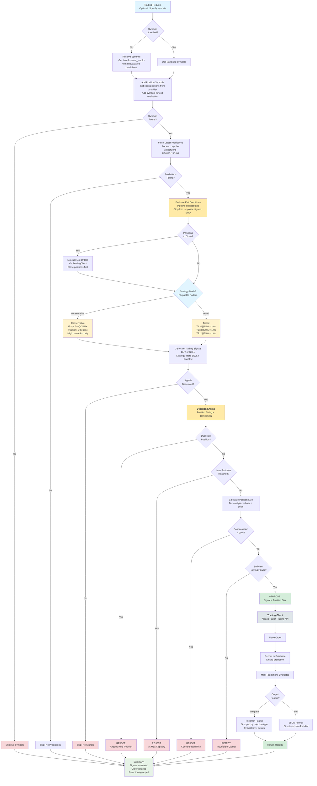

# Phase 3: Paper Trading Implementation Overview

**Purpose**: Complete reference for the paper trading system - what it does, why it exists, and how it works
**Audience**: Developers, stakeholders, and anyone evaluating the trading system

---

## Table of Contents

1. [System Overview](#1-system-overview)
2. [The Data Pipeline (What Feeds Trading)](#2-the-data-pipeline-what-feeds-trading)
3. [Architecture](#3-architecture)
4. [Trading API](#4-trading-api)
5. [Trading Pipeline](#5-trading-pipeline)
6. [Signal Generation](#6-signal-generation)
7. [Position Management](#7-position-management)
8. [Broker Integration](#8-broker-integration)
9. [Data Persistence](#9-data-persistence)
10. [Configuration](#10-configuration)
11. [Deployment](#11-deployment)
12. [What's Next](#12-whats-next)

---

## 1. System Overview

### 1.1 What This System Does

The paper trading system automatically executes simulated stock trades based on machine learning (ML) predictions.

**What is ML in this context?** Machine learning models are algorithms trained on historical market data to recognize patterns. Given a stock's current technical indicators (momentum, volatility, trend signals), the model predicts whether the price will go UP, DOWN, or stay FLAT. The model learns these patterns from thousands of past examples where we know what actually happened after similar conditions.

The trading system reads these forecasts, decides which stocks to buy or sell based on prediction agreement across multiple time horizons, places orders through a broker API, and tracks every trade for performance analysis.

**The complete trading cycle:**
1. ML models predict whether each stock will go UP, DOWN, or stay FLAT over the next 5, 25, 75 minutes, and 5 hours (expressed as 1, 5, 15, 60 bars at 5-minute resolution)
2. The trading system reads these predictions from the database
3. A strategy algorithm evaluates whether predictions show strong enough agreement to warrant a trade
4. If approved, the system calculates how many shares to buy and places the order
5. The system monitors open positions and closes them when stop-loss, opposite signals, or end-of-day conditions are met
6. Every decision is logged and stored for analysis

### 1.2 Why Paper Trading First

Paper trading uses simulated money through Alpaca's paper trading environment. This approach serves several purposes:

**Risk Mitigation**: Before risking real capital, the system must prove it can execute trades correctly, handle errors gracefully, and generate positive returns over time.

**Model Validation**: The ML models were trained on historical data. Paper trading reveals whether those predictions translate to actual trading profits when accounting for execution delays, price slippage, and market conditions.

**System Hardening**: Real trading systems fail in unexpected ways - API timeouts, network issues, race conditions. Paper trading exposes these issues without financial consequences.

**Regulatory Compliance**: All trades are linked to the predictions that triggered them, creating an audit trail that shows why each trade was made.

### 1.3 System Boundaries

**What this system handles:**
- US equity markets via Alpaca Paper Trading API
- 15 symbols in active watchlist, plus adhoc symbols on-demand (not confined to watchlist)
- Market orders only (immediate execution at current price)
- Intraday focus with configurable exit strategies (EOD close, profit-taking, smart overnight holds)
- Long and short positions supported (short selling enabled by default)

**What this system does not handle (currently):**
- Real money trading (separate phase)
- Options, futures, or other derivatives
- Limit orders, stop orders, or other order types

**Note:** Exit strategies are extensible. While intraday (close by EOD) is the current priority, the architecture supports smart EOD logic (hold overnight winners with bullish forecasts) and profit-taking exits. Multi-day positions become possible when overnight holding is enabled.

### 1.4 Multi-Market Architecture (Future-Ready)

While paper trading currently operates on US markets only, the system is architected for global expansion:

**Metadata System**:
- All database tables include `currency`, `country`, and `exchange` columns
- Symbol registry supports 37 symbols across 10 exchanges in 7 regions (US, India, Japan, UK, Germany, Canada, Australia)
- API-first metadata management fetches exchange codes, timezones, and trading hours from YFinance/Alpaca/Polygon
- Exchange code standardization translates provider-specific codes to standards (e.g., YFinance 'NMS' → 'NASDAQ')

**Broker Abstraction**:
- `BaseTradingClient` abstract class enables multiple broker implementations
- `AlpacaTradingClient` implemented for US markets
- `KotakTradingClient` placeholder for India NSE (future)

**Why built this way:** When expanding to India (NSE) or other markets, only the broker client needs implementation. Trading strategies, position sizing, and all business logic work unchanged across markets because metadata drives market-specific behavior (trading hours, currency, settlement rules).

---

## 2. The Data Pipeline (What Feeds Trading)

Before the trading system can make decisions, it needs predictions. Those predictions come from ML models that are trained on processed market data. Understanding this pipeline is essential to understanding why the trading system works the way it does.

### 2.1 The Five-Stage Pipeline

```
┌─────────────────────────────────────────────────────────────────────────────┐
│                        EVERY 10 MINUTES (MARKET HOURS)                      │
├─────────────────────────────────────────────────────────────────────────────┤
│                                                                             │
│   Stage 1: TICKS         Stage 2: BARS            Stage 3: LABELS           │
│  ┌──────────────┐       ┌────────────────┐        ┌──────────────┐          │
│  │ Fetch raw    │       │ Aggregate to   │        │ Calculate    │          │
│  │ price/volume │  ───► │ 5-min OHLCV    │  ───►  │ movement     │          │
│  │ from Alpaca  │       │ + 21 indicators│        │ labels       │          │
│  └──────────────┘       └────────────────┘        └──────────────┘          │
│        │                       │                       │                    │
│        ▼                       ▼                       ▼                    │
│   ohlcv_ticks              bars table             forecast_labels           │
│                                                                             │
├─────────────────────────────────────────────────────────────────────────────┤
│                        2-3x DAILY (LOCAL SERVER)                            │
├─────────────────────────────────────────────────────────────────────────────┤
│                                                                             │
│  Stage 4: TRAINING                                                          │
│  ┌──────────────────────────────────────────────────────────────────┐       │
│  │ Train 4 RandomForest models (one per horizon) from labeled data  │       │
│  │ Upload to Azure Blob Storage as versioned .pkl files             │       │
│  └──────────────────────────────────────────────────────────────────┘       │
│                                                                             │
├─────────────────────────────────────────────────────────────────────────────┤
│                        EVERY 10 MINUTES (MARKET HOURS)                      │
├─────────────────────────────────────────────────────────────────────────────┤
│                                                                             │
│  Stage 5: INFERENCE        Stage 6: TRADING                                 │
│  ┌──────────────┐         ┌──────────────┐                                  │
│  │ Load models, │         │ Read preds,  │                                  │
│  │ generate     │  ───►   │ generate     │  ───►  Alpaca Paper Trading      │
│  │ predictions  │         │ signals,     │                                  │
│  └──────────────┘         │ execute      │                                  │
│        │                  └──────────────┘                                  │
│        ▼                         │                                          │
│   forecast_results          paper_trades                                    │
│                                                                             │
└─────────────────────────────────────────────────────────────────────────────┘
```

### 2.2 Stage 1: Ticks (Raw Market Data)

**What happens:** The system fetches raw price and volume data from market data APIs.

**Current Data Sources (in priority order):**
1. **Alpaca** - Primary source, real-time during market hours
2. **Yahoo Finance** - Backup, free unlimited access
3. **Alpha Vantage** - Secondary backup
4. **Polygon** - Tertiary backup

**Extensible Architecture:** The data ingestion layer uses a provider abstraction pattern. Each data source implements a common interface (`BaseTickClient`), making it straightforward to add new providers (e.g., Interactive Brokers, Tradier, or premium data feeds like Bloomberg). Adding a new source requires implementing the interface and registering it in the priority chain.

**Why multiple sources:** No single API has 100% uptime. When Alpaca is down or rate-limited, the system automatically fails over to the next source. This achieved 97% data availability with 0% data loss.

**What gets stored:** Raw OHLCV (Open, High, Low, Close, Volume) data in the `ohlcv_ticks` table.

### 2.3 Stage 2: Bars (Feature Engineering)

**What happens:** Raw ticks are aggregated into 5-minute bars with technical indicators calculated.

**Why 5-minute bars:**
- Optimal balance between noise reduction and trading opportunity capture
- All data providers support 5-minute data without premium subscriptions
- Sufficient observations (78 bars per trading day) for statistical significance
- Foundation can adapt to 1-minute (high-frequency) or 15-minute (swing) in future

**Current Technical Indicators (21):**

| Category | Indicators | Purpose |
|----------|------------|---------|
| **Trend** | EMA20, EMA50, VWAP | Identify price direction |
| **Momentum** | RSI, MACD, Stochastic, Williams %R | Measure speed of price change |
| **Volatility** | ATR, Bollinger Bands | Measure price variability |
| **Volume** | OBV, Volume MA, Force Index | Confirm price movements |

**Extensible Feature Set:** The indicator calculation pipeline is modular. Adding new indicators (e.g., Ichimoku Cloud, Keltner Channels, custom proprietary signals) requires implementing the calculation function and registering it in the feature engineering configuration. The ML training pipeline automatically incorporates new columns.

**What gets stored:** Feature matrix in the `bars` table (currently 5 OHLCV + 21 indicators = 26 columns, expandable).

### 2.4 Stage 3: Labels (Training Targets)

**What happens:** For each bar, the system calculates what actually happened to the price over the next N bars. This creates the "ground truth" labels that ML models learn to predict.

**Horizons (expressed as bar counts, not time):**

| Horizon | Bars | Time (at 5-min resolution) | Use Case |
|---------|------|----------------------------|----------|
| H1 | 1 bar ahead | 5 minutes | Immediate prediction |
| H5 | 5 bars ahead | 25 minutes | Short-term trend |
| H15 | 15 bars ahead | 75 minutes | Medium-term swing |
| H60 | 60 bars ahead | 5 hours | Long-term position |

**Why bar counts instead of time:** This makes the architecture resolution-independent. If we change to 1-minute bars in the future, the same code and config works - just the time meanings change.

**Label Classification:**

| Label | Condition | Meaning |
|-------|-----------|---------|
| **UP** | Price increased ≥ 0.5% | Stock went up |
| **DOWN** | Price decreased ≥ 0.5% | Stock went down |
| **FLAT** | Price changed < 0.5% | No significant movement |

**Why 0.5% threshold:** Captures meaningful intraday moves while filtering out noise. Too low catches noise; too high misses trading opportunities.

**What gets stored:** Labels in `forecast_labels` table with symbol, timestamp, horizon, and label.

### 2.5 Stage 4: Training (ML Models)

**What happens:** RandomForest classifiers are trained to predict UP/DOWN/FLAT based on the 21 technical indicators.

**Current Algorithm: RandomForest**
- 100 decision trees per model
- Ensemble approach reduces overfitting
- Handles non-linear patterns well
- 60-70% accuracy on 3-class predictions

**Why RandomForest first:**
- Strong baseline for tabular data
- Fast training (~45 seconds for all 4 models)
- Interpretable (can see feature importance)
- No hyperparameter sensitivity

**Available Algorithms (for future experimentation):**

| Type | Algorithms | Status |
|------|------------|--------|
| **Tabular** (current features) | RandomForest, XGBoost, LightGBM, CatBoost, Logistic Regression, SVM | Ready to use |
| **Sequence** (requires sliding window) | LSTM, 1D CNN, Transformer | Future expansion |

**Training Schedule:** Manual 2-3x daily on local server. Azure free tier doesn't have sufficient compute for training, so this runs on a dedicated machine where hardware supports it.

**What gets stored:** Versioned model files (e.g., `model_v0.1_1_rf.pkl`) uploaded to Azure Blob Storage.

### 2.6 Stage 5: Inference (Predictions)

**What happens:** When called, the inference API loads the trained models from Azure Blob Storage and generates predictions for each symbol and horizon.

**Prediction Output (per symbol, per horizon):**

| Field | Example | Meaning |
|-------|---------|---------|
| `symbol` | AAPL | Stock being predicted |
| `horizon` | 5 | Predicting 5 bars (25 minutes) ahead |
| `label` | UP | Model predicts price will increase |
| `confidence` | 0.73 | 73% confident in this prediction |
| `timestamp` | 2026-01-29 10:30:00 | When prediction was made |

**Performance:** <0.2 seconds per prediction with cached models.

**What gets stored:** Predictions in `forecast_results` table, linked to the input bar that generated them.

### 2.7 What the Trading System Receives

By the time the trading system runs, the `forecast_results` table contains:

```
┌─────────┬─────────┬───────┬────────────┬─────────────────────┐
│ symbol  │ horizon │ label │ confidence │ timestamp           │
├─────────┼─────────┼───────┼────────────┼─────────────────────┤
│ AAPL    │ 1       │ UP    │ 0.68       │ 2026-01-29 10:30:00 │
│ AAPL    │ 5       │ UP    │ 0.73       │ 2026-01-29 10:30:00 │
│ AAPL    │ 15      │ UP    │ 0.71       │ 2026-01-29 10:30:00 │
│ AAPL    │ 60      │ DOWN  │ 0.65       │ 2026-01-29 10:30:00 │
│ MSFT    │ 1       │ FLAT  │ 0.82       │ 2026-01-29 10:30:00 │
│ MSFT    │ 5       │ UP    │ 0.69       │ 2026-01-29 10:30:00 │
│ ...     │ ...     │ ...   │ ...        │ ...                 │
└─────────┴─────────┴───────┴────────────┴─────────────────────┘
```

**The trading system's job:** Read these predictions, determine if they show enough agreement to trade, and execute orders accordingly.

---

## 3. Architecture

### 3.1 Where Trading Fits in the Overall System

The trading system is Stage 6 of the complete pipeline - the final step that turns predictions into actual trades.

```
Market Data → Technical Features → Labels → Training → Predictions → Trading
     ↑              ↑                ↑          ↑            ↑           ↑
   Stage 1      Stage 2          Stage 3    Stage 4      Stage 5      Stage 6
    Ticks         Bars           Labels     Train       Inference    THIS SYSTEM
```

Each stage runs as a separate API call orchestrated by N8N (workflow automation platform). This allows independent scaling, monitoring, and failure isolation.

### 3.2 Three-Container Deployment

The system runs as three independent Docker containers:

| Container | Port | Responsibility |
|-----------|------|----------------|
| **Inference API** | 8000 | Loads ML models, generates predictions |
| **Pipeline API** | 8001 | Data ingestion, feature engineering, training |
| **Trading API** | 8002 | Reads predictions, executes trades |

**Why separate containers?**

- **Independent Scaling**: Trading needs fast response during market hours; inference needs GPU resources; pipelines are I/O bound
- **Fault Isolation**: A crash in one container doesn't affect others
- **Deployment Flexibility**: Can update trading logic without reloading ML models
- **Resource Management**: Each container has dedicated memory and CPU limits

### 3.3 Clean Architecture Layers

The trading system follows Clean Architecture principles with four distinct layers:

```
┌─────────────────────────────────────────────────────────────┐
│  INTERFACES (API Layer)                                     │
│  FastAPI endpoints, request/response handling               │
│  Entry point for external systems (N8N, manual calls)       │
└─────────────────────────────────────────────────────────────┘
                              │
                              ▼
┌─────────────────────────────────────────────────────────────┐
│  APPLICATION (Orchestration Layer)                          │
│  TradingPipeline coordinates the workflow                   │
│  DecisionEngine validates constraints with logging          │
└─────────────────────────────────────────────────────────────┘
                              │
                              ▼
┌─────────────────────────────────────────────────────────────┐
│  DOMAIN (Business Logic Layer)                              │
│  Strategies, position sizing, exit evaluation               │
│  Pure logic with no external dependencies                   │
└─────────────────────────────────────────────────────────────┘
                              │
                              ▼
┌─────────────────────────────────────────────────────────────┐
│  INFRASTRUCTURE (External Systems Layer)                    │
│  Alpaca API client, database repository                     │
│  Handles all external communication                         │
└─────────────────────────────────────────────────────────────┘
```

**Why this separation matters:**

- **Testability**: Domain logic can be unit tested without databases or APIs
- **Flexibility**: Can swap Alpaca for another broker without changing trading logic
- **Maintainability**: Changes in one layer don't cascade to others
- **Compliance**: Business rules are centralized and auditable

---

## 4. Trading API

### 4.1 What the API Does

The Trading API is the entry point for the trading system. When called, it:
1. Reads unprocessed predictions from the database
2. Generates trading signals based on the configured strategy
3. Validates signals against portfolio constraints
4. Submits approved orders to the configured broker (currently Alpaca, extensible to others)
5. Saves trade records to the database
6. Returns a summary for Telegram notification

**Location**: `src/interfaces/api/trading/`

### 4.2 The Execute Endpoint

**POST /trading/execute**

This endpoint is called by N8N on a configurable schedule during market hours. The frequency depends on trading strategy requirements and is not fixed - the system supports any interval from minutes to hours.

**Execution Speed:** With the current 15-symbol watchlist, the complete pipeline (ticks → bars → labels → inference → trading) completes in ~3 minutes. This speed comes from intelligent data fetching modes:
- **Incremental** (~90% of runs): Fetches only new data since last run → fastest path
- **Hybrid** (~8% of runs): New data + provider corrections → handles data quality
- **Full** (~2% of runs): Complete reprocessing → used for backfills or recovery

**Request Parameters:**

| Parameter | Purpose | Default |
|-----------|---------|---------|
| `symbols` | Filter to specific stocks (null = all with recent predictions) | null |
| `min_confidence` | Minimum prediction confidence to consider | 0.70 |
| `max_positions` | Maximum concurrent positions allowed | 10 |
| `mode` | Execution mode (auto, full, incremental) | "auto" |
| `telegram_format` | Format response for Telegram notification | true |

**What the endpoint returns:**

```json
{
  "success": true,
  "signals_evaluated": 5,
  "orders_placed": 2,
  "positions_closed": 1,
  "run_id": 3456,
  "summary_message": "[Run 3456] 2 orders placed, 1 position closed",
  "telegram_message": "formatted message for Telegram alert",
  "signal_evaluations": [...],
  "signal_rejections": [...],
  "position_evaluations": [...]
}
```

**Why these fields matter:**

- `run_id`: Links to the run_executions table for complete audit trail
- `signal_evaluations`: Shows which signals were approved and why
- `signal_rejections`: Shows which signals were rejected and why (duplicate position, max positions, etc.)
- `position_evaluations`: Shows exit decisions for open positions

### 4.3 Health Check Endpoint

**GET /trading/health**

Returns service status for monitoring. Azure uses this to detect unhealthy containers and restart them.

---

## 5. Trading Pipeline

### 5.1 What the Pipeline Does

The TradingPipeline is the orchestrator that coordinates all trading activities. It implements the complete workflow from reading predictions to submitting orders.

**Location**: `src/application/trading_pipeline.py`

### 5.2 The Execution Workflow

When `execute()` is called, the pipeline runs through these steps:

**Step 1: Symbol Resolution**
```
If symbols provided in request → use those symbols
Else → query forecast_results for symbols with unprocessed predictions
```

This allows both targeted execution (specific stocks) and automatic mode (process all available predictions).

**Step 2: Prediction Fetch**

For each symbol, fetches the latest predictions from the `forecast_results` table. The query filters for:
- Predictions from the last 60 minutes
- Predictions not yet evaluated for trading (`trading_evaluated_at IS NULL`)

This idempotent design prevents the same prediction from triggering multiple trades across runs.

**Step 3: Signal Generation**

Passes predictions to the configured strategy (Conservative or Tiered). The strategy evaluates whether predictions show sufficient agreement to generate a BUY or SELL signal.

**Step 4: Forecast Marking**

Immediately marks all evaluated forecasts with a `trading_evaluated_at` timestamp. Even if no signal is generated, the forecast is marked as processed to prevent re-evaluation.

**Step 5: Signal Evaluation**

For each generated signal, the Decision Engine validates portfolio constraints:
- Not already holding this stock
- Under max positions limit
- Within concentration limits (no single stock > 20% of portfolio)
- Sufficient buying power

**Step 6: Order Submission**

Approved signals are submitted to Alpaca as market orders. The response includes order_id, fill price, and status.

**Step 7: Trade Persistence**

Executed orders are saved to the `paper_trades` table with:
- Link to the run (`run_id`)
- Link to the forecast that triggered it (`forecast_result_id`)
- Entry details (price, quantity, timestamp)
- Prediction details (predicted_label, confidence, target_ts)

**Step 8: Exit Evaluation**

Fetches all open positions and checks exit conditions:
- Stop-loss hit (loss exceeds configured threshold, default 5%)
- Opposite signal (new prediction contradicts position direction)
- End of day (market close approaching, default 3:55 PM EST)

**Step 9: Summary**

Returns execution summary with counts of signals evaluated, orders placed, positions closed, and detailed breakdowns for Telegram notification.

### 5.3 Error Handling

The pipeline uses error isolation - a failure for one symbol doesn't abort the entire run:

```
For each symbol:
    Try:
        Evaluate signal
        Submit order if approved
    Except:
        Log error
        Continue to next symbol
```

This ensures a network timeout on one order doesn't prevent other trades from executing.

### 5.4 Complete Workflow Diagram

The following diagram shows the complete end-to-end workflow from trading request through signal evaluation, decision engine constraints, and order execution:



**Key Flow Characteristics:**

- **Exits First**: Positions are evaluated for exits before new signals are processed
- **Pluggable Strategy**: Conservative or Tiered strategy selected via configuration
- **Six Constraint Checks**: Each signal passes through duplicate, max positions, quantity calculation, concentration, buying power, and approval
- **Error Isolation**: Symbol failures don't abort the entire run (collect results at end)
- **Dual Format Output**: Telegram for human readability, JSON for N8N automation
- **Audit Trail**: Every decision logged with prediction linkage for compliance

---

## 6. Signal Generation

### 6.1 What Signal Generation Does

Signal generation converts ML predictions into actionable trading signals. The challenge: we have 4 predictions per stock (1-minute, 5-minute, 15-minute, 60-minute horizons) - how do we decide when to trade?

**Location**: `src/domain/trading/strategies/`

### 6.2 The Multi-Horizon Consensus Approach

Rather than acting on any single prediction, the system requires agreement across multiple time horizons. This reduces noise and increases signal quality.

**Why consensus matters:**

- A single horizon spike might be noise (model uncertainty)
- Multiple horizons agreeing suggests a stronger underlying pattern
- Different horizons capture different market dynamics (short-term momentum vs. longer-term trends)

**Example scenarios:**

| H1 | H5 | H15 | H60 | Result |
|----|----|----|-----|--------|
| UP 75% | UP 80% | UP 72% | UP 78% | Strong BUY - all horizons agree |
| UP 75% | UP 70% | DOWN 65% | UP 68% | No signal - insufficient agreement |
| UP 55% | UP 60% | UP 58% | UP 62% | No signal - confidence too low |
| FLAT 70% | FLAT 75% | FLAT 80% | FLAT 72% | No signal - FLAT predictions excluded |

### 6.3 Conservative Strategy

The Conservative Strategy is the baseline approach requiring strong agreement.

**Algorithm:**
1. Filter predictions by confidence threshold (default: 70%)
2. Count how many horizons predict UP vs DOWN (FLAT excluded)
3. If 3+ horizons agree on same direction → generate signal
4. Calculate aggregate confidence as average of agreeing horizons

**Configuration:**
| Parameter | Default | Description |
|-----------|---------|-------------|
| `confidence_threshold` | 0.70 | Minimum confidence per prediction |
| `min_horizons_agree` | 3 | Minimum horizons required |

**Characteristics:**
- Lower trading frequency (stricter criteria)
- Higher expected win rate (stronger signals)
- Standard position sizing (1.0x multiplier)

### 6.4 Tiered Strategy

The Tiered Strategy enables more aggressive trading with risk-adjusted position sizing.

**Three Tiers:**

| Tier | Horizons Required | Confidence | Position Multiplier | Rationale |
|------|-------------------|------------|---------------------|-----------|
| **Tier 1 (Strong)** | All 4 horizons | 65%+ | 2.0x | Highest conviction = larger position |
| **Tier 2 (Moderate)** | Any 3 horizons | 70%+ | 1.0x | Standard signal = standard position |
| **Tier 3 (Weak)** | Any 2 horizons | 75%+ | 1.0x | Lower conviction but high confidence |

**Tier 3 Special Requirement:**

For Tier 3 signals, both H1 AND H5 must be among the agreeing horizons. This prevents signals based only on long-term predictions (H15+H60) which may not be actionable for intraday trading.

**Why this matters:**
- Long-term predictions might be correct over 60 minutes but wrong for the next 5 minutes
- Intraday trading needs near-term confirmation
- The short-term filter reduces overnight-style signals in an intraday strategy

**Evaluation Order:**

The strategy evaluates tiers from strongest to weakest. First match wins:
1. Check Tier 1 (4 horizons at 65%+)
2. If no match, check Tier 2 (3 horizons at 70%+)
3. If no match, check Tier 3 (2 horizons at 75%+ with H1+H5)
4. If no match, no signal generated

### 6.5 Strategy Selection

Strategy is configured in `config.yaml`:

```yaml
trading:
  strategy:
    type: 'tiered'  # or 'conservative'
```

This allows A/B testing different strategies without code changes.

### 6.6 Evaluation Context

Each strategy tracks why signals were or were not generated for every symbol. This context is included in the API response and Telegram messages:

```
AAPL: "Conservative BUY: 3/4 horizons UP at 74% avg (H1, H5, H60)"
MSFT: "Tiered: No tier matched - T1(65%): 2↑/0↓ | T2(70%): 2↑/0↓ | T3(75%): 1↑/0↓"
GOOGL: "Conservative: Only 2 UP (H1, H5) / 1 DOWN (H15), needs 3+ for signal"
```

This transparency helps diagnose why the system did or didn't trade.

---

## 7. Position Management

### 7.1 What Position Management Does

Position management handles two responsibilities:
1. **Position Sizing**: Determining how many shares to buy for each signal
2. **Exit Evaluation**: Deciding when to close open positions

### 7.2 Position Sizer

**Location**: `src/domain/trading/position_sizer.py`

The Position Sizer calculates trade quantity and validates portfolio constraints.

**Sizing Approach:**

The system uses fixed-dollar position sizing:
```
quantity = position_size_usd / current_price
```

Example: $5,000 position at $250/share = 20 shares

**Why fixed-dollar sizing:**
- Simple to understand and audit
- Consistent risk per trade regardless of stock price
- Easy to configure for different risk tolerances

**Fractional Share Support:**

The system supports fractional shares (e.g., 0.1 shares). This enables:
- Testing with minimal capital (0.1 shares at $250 = $25 per trade)
- Precise position sizing without rounding errors
- Alpaca Paper Trading API supports fractional shares for long positions

### 7.3 Portfolio Constraints

Before approving a trade, the system validates these constraints:

**1. Duplicate Position Check**
```
If already holding this symbol → reject signal
Reason: DUPLICATE_POSITION
```

Prevents pyramiding into existing positions. Can be disabled via config for testing.

**2. Maximum Positions Check**
```
If current positions >= max_positions → reject signal
Reason: MAX_POSITIONS
```

Enforces diversification. Default limit: 10 concurrent positions.

**3. Concentration Limit Check**
```
If position_value > portfolio_value * max_pct → reduce quantity
If reduced quantity < minimum → reject signal
Reason: CONCENTRATION_LIMIT
```

Prevents any single position from exceeding 20% of portfolio (configurable).

**4. Buying Power Check**
```
If position_value > buying_power → reduce quantity or reject
Reason: INSUFFICIENT_BUYING_POWER
```

Ensures sufficient funds are available. Critical during extended hours when buying power may be reduced.

### 7.4 Decision Engine

**Location**: `src/application/services/conservative_decision_engine.py`

The Decision Engine orchestrates position sizing with full observability. It wraps the pure domain logic (PositionSizer) with logging for audit compliance.

**Why a separate Decision Engine:**

The PositionSizer is pure domain logic - no logging, no side effects. The Decision Engine adds:
- Step-by-step logging of each constraint check
- Structured decision results (approved/rejected with context)
- Tier-based position multiplier application
- Complete audit trail for regulatory review

**Logging Pattern:**

Each constraint check is logged before and after:
```
Check_Duplicate | Check_Start | "Checking duplicate - symbol: AAPL, open_positions: 5"
Check_Duplicate | Check_Passed | "No existing position for AAPL"
```

This creates a complete record of every decision made by the system.

### 7.5 Exit Evaluator

**Location**: `src/domain/trading/exit_evaluator.py`

The Exit Evaluator checks whether open positions should be closed.

**Current Exit Conditions:**

| Condition | Trigger | Rationale |
|-----------|---------|-----------|
| **Stop Loss** | Loss >= 5% (configurable) | Limit downside risk |
| **Opposite Signal** | New BUY signal while holding SELL (or vice versa) | Model changed its view |
| **End of Day** | Within 5 minutes of market close (3:55 PM EST) | Avoid overnight risk (current default) |

**Stop Loss Calculation:**
```
unrealized_pnl_pct = (current_price - entry_price) / entry_price
if unrealized_pnl_pct <= -stop_loss_pct → exit
```

**Why these exit conditions:**

- **Stop Loss**: A 5% stop limits damage from bad trades. Configurable per strategy.
- **Opposite Signal**: If the model's view changed, we should respect the new prediction rather than hold a contradicted position.
- **End of Day**: Current default closes all positions before market close to avoid overnight risk.

**Extensible Exit Framework:** The exit evaluator is designed for additional strategies:
- **Smart EOD** (planned): Hold overnight winners if forecast remains bullish, close losers regardless
- **Profit-Taking** (planned): Exit when position reaches configurable profit target (e.g., 3%)
- **Tier-Based Exit** (planned): Use same tiered consensus logic for exits as entries

The architecture supports adding new exit conditions by implementing the evaluation function and registering it in the exit pipeline.

---

## 8. Broker Integration

### 8.1 What Broker Integration Does

Broker integration handles all communication with Alpaca for order execution, position tracking, and price data.

**Location**: `src/infrastructure/external/trading/`

### 8.2 Multi-Provider Architecture

The system is designed to support multiple brokers through an abstract base class:

```
BaseTradingClient (abstract)
├── AlpacaTradingClient (implemented - US markets)
└── KotakTradingClient (future - India NSE)
```

**Why this architecture:**

- **Geographic Expansion**: Same trading logic works with different regional brokers. The metadata system provides exchange-specific trading hours, currency, and settlement rules.
- **Redundancy**: Could fall back to alternative broker if primary is down
- **Testing**: Easy to mock for unit tests

**How metadata enables multi-market:**

When adding a new market (e.g., India NSE), the process is:
1. Add symbols to `metadata_seed.json` (e.g., `"India": ["INFY.NS", "TCS.NS"]`)
2. Run `rebuild_metadata.py` to fetch exchange codes, timezones, currency from APIs
3. Implement `KotakTradingClient` with same interface as `AlpacaTradingClient`
4. Configure broker in `config.yaml`

The trading strategies, position sizing, and all business logic remain unchanged - they read market-specific behavior from the metadata system.

### 8.3 Alpaca Trading Client

**Location**: `src/infrastructure/external/trading/alpaca_trading_client.py`

The Alpaca client implements trading operations for US markets.

**Key Methods:**

| Method | Purpose | API Endpoint |
|--------|---------|--------------|
| `place_market_order()` | Submit buy/sell order | POST /v2/orders |
| `get_positions()` | Fetch open positions | GET /v2/positions |
| `get_account_balance()` | Get cash, buying power, equity | GET /v2/account |
| `get_latest_prices()` | Get current stock prices | GET /v2/stocks/quotes/latest |

**Two Separate APIs:**

Alpaca uses different base URLs for trading vs market data:

| API | Base URL | Purpose |
|-----|----------|---------|
| Paper Trading | `paper-api.alpaca.markets` | Orders, positions, account |
| Market Data | `data.alpaca.markets` | Quotes, trades, bars |

This distinction matters - using the wrong URL returns 404 errors.

### 8.4 Shared Functionality

The base class provides:

**Rate Limiting:**
Alpaca allows 200 requests/minute. The client tracks request counts and delays when approaching limits.

**Retry Logic:**
Failed requests retry with exponential backoff (1s, 2s, 4s). After 3 failures, raises exception.

**API Logging:**
Every API call is logged to `api_raw_responses` table:
- Request parameters
- Response data
- Status code
- Timing

This enables debugging and cost monitoring.

### 8.5 Order Execution

When placing an order:

1. **Validate Parameters**: Symbol, quantity, side (buy/sell)
2. **Submit to Alpaca**: POST /v2/orders with market order type
3. **Parse Response**: Extract order_id, status, fill details
4. **Return Order Object**: Structured data for caller

**Order States:**

| Status | Meaning |
|--------|---------|
| `new` | Order submitted, awaiting execution |
| `filled` | Order fully executed |
| `partially_filled` | Some shares executed |
| `canceled` | Order canceled (by user or system) |
| `rejected` | Order rejected by broker |

### 8.6 Fractional Share Support

The system fully supports fractional shares for all operations - buy, sell, long, and short positions. The Position Sizer calculates quantities based on `position_size_usd / current_price`.

**Alpaca Paper Trading Limitation:**

Alpaca's paper trading environment has a constraint: **sell orders require whole shares**. This affects both closing long positions and opening short positions.

**Current Testing Configuration:**

To work around this limitation during paper trading, the system uses `order_quantity_override: 1` in config.yaml. This bypasses the Position Sizer calculation and uses a fixed 1-share quantity for all trades.

```yaml
order_quantity_override: 1  # Fixed quantity for testing (bypasses position sizing)
                            # Set to null for production (uses position_size_usd calculation)
```

**Short Selling Toggle:**

- Config flag: `trading.allow_short_selling` (default: true)
- When true: SELL signals generate short positions
- When false: System only generates BUY signals (long-only mode)

**Current Strategy:**

Long and short positions with intraday focus. Positions are closed via configurable exit conditions:
- Stop-loss (sell to close)
- End-of-day (sell to close) - configurable, with smart EOD planned
- Opposite signal (sell to close, but don't open short)
- Profit-taking (planned) - exit at configurable profit target

---

## 9. Data Persistence

### 9.1 What Data Persistence Does

The Trading Repository handles all database operations for the trading system.

**Location**: `src/infrastructure/repositories/trading_repository.py`

### 9.2 The paper_trades Table

Every trade is recorded in `trading.paper_trades` with complete context:

**Identity & Timing:**
| Column | Purpose |
|--------|---------|
| `id` | Primary key |
| `symbol` | Stock symbol (e.g., AAPL) |
| `entry_ts` | When position opened |
| `exit_ts` | When position closed (null if open) |
| `target_ts` | When to evaluate prediction accuracy |

**Position Details:**
| Column | Purpose |
|--------|---------|
| `side` | BUY or SELL |
| `qty` | Number of shares |
| `entry_price` | Price at entry |
| `exit_price` | Price at exit (null if open) |

**Prediction Linkage:**
| Column | Purpose |
|--------|---------|
| `predicted_label` | UP, DOWN, or FLAT |
| `confidence` | Aggregate confidence (0.0-1.0) |
| `horizon` | Primary horizon (1, 5, 15, or 60 minutes) |
| `forecast_result_id` | FK to the specific prediction that triggered this trade |

**Broker Integration:**
| Column | Purpose |
|--------|---------|
| `provider` | ALPACA, KOTAK, or NULL (validation-only) |
| `order_id` | Broker's order identifier |
| `order_status` | new, filled, canceled, rejected |

**Audit Trail:**
| Column | Purpose |
|--------|---------|
| `run_id` | FK to run_executions - which pipeline run created this trade |
| `trade_result` | WIN, LOSS, FLAT, or PENDING |

**Why this schema matters:**

- **Prediction → Trade Linkage**: `forecast_result_id` enables analyzing which predictions led to profitable trades
- **Run Tracking**: `run_id` enables debugging and cost monitoring per execution
- **Dual Workflow Support**: `provider` being null supports validation-only trades from backtesting

### 9.3 The forecast_results Table (Trading-Related)

The `forecast_results` table gained a column for trading:

| Column | Purpose |
|--------|---------|
| `trading_evaluated_at` | Timestamp when this forecast was evaluated for trading |

**Why this column:**

- **Idempotent Processing**: Prevents the same prediction from triggering multiple trades
- **Query Efficiency**: Partial index on NULL values speeds up "get unprocessed" queries
- **Audit Trail**: Shows exactly when each prediction was used

### 9.4 Key Database Operations

**Save Trade:**
Creates a new record when an order is placed. Links to both the run and the originating forecast.

**Get Open Positions:**
Fetches all records where `exit_ts IS NULL`. Used for exit evaluation.

**Update Position Exit:**
Sets `exit_ts`, `exit_price`, and `trade_result` when a position is closed.

**Get Latest Predictions:**
Fetches unprocessed forecasts (`trading_evaluated_at IS NULL`) for signal generation.

**Mark Forecasts Evaluated:**
Sets `trading_evaluated_at` timestamp after processing, preventing re-evaluation.

### 9.5 Database Access Pattern

All database access follows project standards:
- **SELECT**: Via `DataFetcher.fetch_table()` - never raw SQL
- **INSERT**: Via `DataWriter.bulk_insert()` - atomic, batched
- **UPDATE**: Via `DataWriter.bulk_update()` - key-based

This consistency enables centralized logging, performance monitoring, and easier maintenance.

---

## 10. Configuration

### 10.1 What Configuration Controls

All trading behavior is controlled through `config.yaml`, enabling changes without code modifications.

**Location**: `src/config.yaml` → `trading` section

### 10.2 Trading Parameters

**Signal Generation:**
| Parameter | Default | Description |
|-----------|---------|-------------|
| `confidence_threshold` | 0.70 | Minimum prediction confidence to consider |
| `min_horizons_agree` | 3 | Horizons required for Conservative strategy |

**Position Sizing:**
| Parameter | Default | Description |
|-----------|---------|-------------|
| `position_size_usd` | 5000.0 | Dollar amount per trade |
| `order_quantity_override` | null | Fixed quantity for testing (e.g., 0.1 shares) |
| `max_positions` | 10 | Maximum concurrent positions |
| `max_portfolio_pct_per_symbol` | 0.20 | Maximum 20% in any single stock |

**Risk Management:**
| Parameter | Default | Description |
|-----------|---------|-------------|
| `stop_loss_pct` | 0.05 | Exit if loss exceeds 5% |
| `allow_short_selling` | false | Enable short positions |

**Market Hours:**
| Parameter | Default | Description |
|-----------|---------|-------------|
| `market_close_hour` | 15 | Hour to start EOD exits (EST) |
| `market_close_minute` | 55 | Minute to start EOD exits |

### 10.3 Strategy Configuration

```yaml
trading:
  strategy:
    type: 'tiered'  # 'conservative' or 'tiered'

    # Conservative parameters
    confidence_threshold: 0.70
    min_horizons_agree: 3

    # Tiered parameters
    tier1_confidence: 0.65
    tier2_confidence: 0.70
    tier3_confidence: 0.75
    require_short_term_tier3: true

  tier_multipliers:
    tier1: 2.0    # Strong signal = 2x position
    tier2: 1.0    # Moderate signal = standard position
    tier3: 1.0    # Weak signal = standard position
```

### 10.4 Constraint Toggles

| Parameter | Default | Description |
|-----------|---------|-------------|
| `enable_duplicate_check` | true | Prevent holding same stock twice |

Disabling constraints is useful for testing but not recommended for production.

### 10.5 Environment Variables

Sensitive credentials are stored as environment variables:

| Variable | Purpose |
|----------|---------|
| `ALPACA_KEY_ID` | Alpaca API key |
| `ALPACA_SECRET_KEY` | Alpaca API secret |

These are set in Azure Key Vault for production.

---

## 11. Deployment

### 11.1 How the System Runs

The trading system runs as a Docker container in Azure, orchestrated by N8N workflows.

### 11.2 N8N Orchestration

N8N (workflow automation platform) triggers the complete trading cycle every 10 minutes during market hours:

```
Cron Trigger (Weekdays, 6am-1pm PST)
    │
    ▼
┌────────────────────────────┐
│ Data Pipeline              │
│ Ticks → Bars → Labels      │
│ POST /pipeline/{type}      │
└────────────────────────────┘
    │
    ▼
┌────────────────────────────┐
│ Inference                  │
│ Generate predictions       │
│ POST /infer/predict        │
└────────────────────────────┘
    │
    ▼
┌────────────────────────────┐
│ Telegram Alert             │
│ Send forecast summary      │
└────────────────────────────┘
    │
    ▼
┌────────────────────────────┐
│ Trading Execution          │
│ Execute trades             │
│ POST /trading/execute      │
└────────────────────────────┘
    │
    ▼
┌────────────────────────────┐
│ Telegram Alert             │
│ Send trading summary       │
└────────────────────────────┘
```

**Why N8N:**
- Reuses existing free infrastructure (Azure Web App free tier)
- Visual workflow makes debugging easy
- Cost monitoring: ~3,300 executions/month (under 5,000 free limit)
- Market hours control built into cron expression

### 11.3 Docker Configuration

**Dockerfile**: `src/interfaces/api/trading.Dockerfile`

The trading container includes:
- Python 3.11 slim base image
- All domain and infrastructure dependencies
- CA certificates for HTTPS broker connections
- Health check on `/trading/health`

**Why a dedicated Dockerfile:**

The trading API needs different dependencies than inference (no ML libraries) but shares domain and infrastructure code. Selective copying keeps the image small while ensuring all imports work.

### 11.4 Azure Deployment

The trading container runs as a sidecar alongside inference and pipeline containers:

| Container | Port | Health Check |
|-----------|------|--------------|
| inference-api | 8000 | /infer/health |
| pipeline-api | 8001 | /pipeline/health |
| trading-api | 8002 | /trading/health |

**Environment Setup:**
- Credentials in Azure Key Vault
- Config mounted as volume
- Automatic restart on health check failure

---

## 12. What's Next

### 12.1 Remaining Phase 3 Work

Phase 3 (Paper Trading) is approximately 43% complete. The foundation is operational - signals are generated, orders execute through Alpaca, and trades are tracked. Remaining work focuses on operational maturity:

**Portfolio Sync & Monitoring (Task 3.4)**
- Reconcile database positions with Alpaca's reported positions
- Handle edge cases: orders placed outside the system, partial fills, corporate actions
- Build position drift detection and alerting

**Paper Trading Analytics (Task 3.5)**
- Calculate win rate, Sharpe ratio, max drawdown, and other performance metrics
- Build daily/weekly performance reports
- Compare strategy performance (Conservative vs Tiered)

**Developer Tools (Task 3.6)**
- Command-line utilities for trade inspection and debugging
- Position history viewer
- Signal evaluation replay for diagnosis

### 12.2 Phase 4: Core Validation Infrastructure

Before expanding the model or risking real capital, the system needs rigorous backtesting:

**Walk-Forward Backtesting Engine**
- Test how the model would have performed on historical data
- Use walk-forward validation (train on past, test on future, slide window)
- Measure true out-of-sample accuracy vs live trading results

**Historical Validation**
- Backtest existing tech-only models (currently 60-70% accuracy)
- Quantify expected profitability before live deployment
- Identify market conditions where the model underperforms

**Anomaly Detection**
- Detect when model accuracy drifts below acceptable thresholds
- Alert when market conditions differ significantly from training data
- Track prediction confidence calibration over time

### 12.3 Phases 5-6: Additional Data Sources

The current model uses only technical indicators (price and volume patterns). Future phases add new data types:

**Phase 5: Sentiment Pipeline**
- Integrate financial news sentiment via Alpha Vantage News API
- Calculate sentiment scores per symbol
- Add sentiment features to ML training data
- Hypothesis: News sentiment improves prediction during earnings seasons and major events

**Phase 6: Fundamentals Pipeline**
- Ingest earnings dates, revenue, EPS, and other financial metrics
- Add fundamental context (is price move driven by earnings surprise?)
- Create features like "days until earnings", "PE ratio vs sector"
- Hypothesis: Fundamental context improves longer-horizon predictions (H15, H60)

### 12.4 Phase 7: Multi-Model Framework

Once additional data sources are integrated, the system trains multiple model versions:

**Model Versions**
- v0.1: Technical indicators only (current baseline)
- v0.2: Technical + Sentiment
- v0.3: Technical + Sentiment + Fundamentals

**Model Comparison Framework**
- A/B test different model versions in paper trading
- Measure which version performs best under different market conditions
- Build model selection logic (e.g., use sentiment model during high-news periods)

### 12.5 Phases 8-10: Production Readiness

**Phase 8: Deployment & Documentation**
- Azure deployment automation (CI/CD pipeline)
- N8N workflow updates for new pipelines
- Complete documentation for handoff

**Phase 9: Unified Dashboard**
- Consolidated view of predictions, trades, and performance
- Real-time monitoring during market hours
- Historical analysis tools

**Phase 10: Test Quality**
- Expand test coverage for edge cases
- Performance benchmarking
- Integration test automation

### 12.6 Timeline Perspective

The project follows a disciplined approach: **validate before risking capital**. The remaining phases build confidence in the system through:

1. **Operational Maturity** (Phase 3 completion): Ensure paper trading runs reliably
2. **Historical Validation** (Phase 4): Prove the model works on past data
3. **Feature Expansion** (Phases 5-6): Add data sources that may improve accuracy
4. **Model Selection** (Phase 7): Choose the best model variant
5. **Production Deployment** (Phases 8-10): Scale up with confidence

Real money trading is not a specific phase - it's a decision made after paper trading demonstrates consistent profitability and the system proves operationally robust.

---

## Appendix

### A. File Reference

| Component | Location | Purpose |
|-----------|----------|---------|
| **API** | `src/interfaces/api/trading/` | FastAPI endpoints |
| **Factory** | `src/interfaces/factories/trading_pipeline_factory.py` | Dependency injection |
| **Pipeline** | `src/application/trading_pipeline.py` | Workflow orchestration |
| **Decision Engine** | `src/application/services/conservative_decision_engine.py` | Constraint validation with logging |
| **Strategies** | `src/domain/trading/strategies/` | Signal generation algorithms |
| **Position Sizer** | `src/domain/trading/position_sizer.py` | Sizing and constraints |
| **Exit Evaluator** | `src/domain/trading/exit_evaluator.py` | Exit condition logic |
| **Models** | `src/domain/trading/models.py` | Domain entities |
| **Trading Client** | `src/infrastructure/external/trading/` | Alpaca integration |
| **Repository** | `src/infrastructure/repositories/trading_repository.py` | Database operations |

### B. Related Documentation

| Document | Content |
|----------|---------|
| [EXECUTION_PLAN.md](../../EXECUTION_PLAN.md) | Phase 3 task tracking and overall project status |
| [Phase03_PAPER_TRADING.md](Phase03_PAPER_TRADING.md) | Detailed implementation history and issue resolutions |
| [ARCHITECTURE.md](../../Standards/ARCHITECTURE.md) | Clean Architecture standards |
| [DEVELOPMENT_PRINCIPLES.md](../../Standards/DEVELOPMENT_PRINCIPLES.md) | Coding standards |

### C. Key Design Decisions

| Decision | Choice | Rationale |
|----------|--------|-----------|
| Multi-horizon consensus | 3-4 horizons must agree | Reduces noise, increases signal quality |
| Fixed-dollar position sizing | $5,000 per trade | Simple, consistent risk per trade |
| Intraday focus (default) | EOD close with extensible exits | Avoids overnight risk; smart EOD and profit-taking planned |
| Short selling enabled | Whole shares for shorts | Alpaca fractional limitation; rounds up to whole shares |
| Separate Decision Engine | Wrapper with logging | Pure domain logic + audit compliance |
| Idempotent processing | Mark forecasts after evaluation | Prevents duplicate trades |
| Strategy pattern | Pluggable algorithms | Easy A/B testing, future extensibility |
